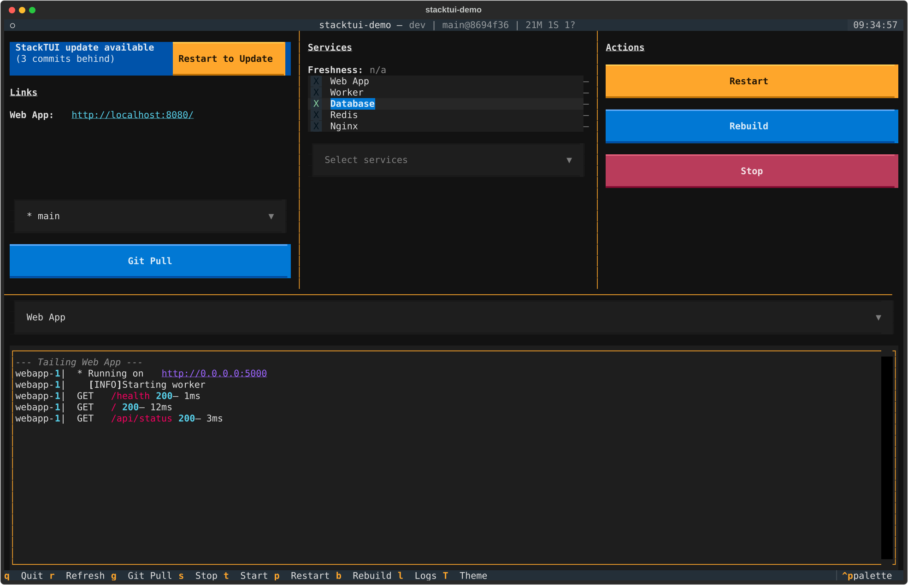
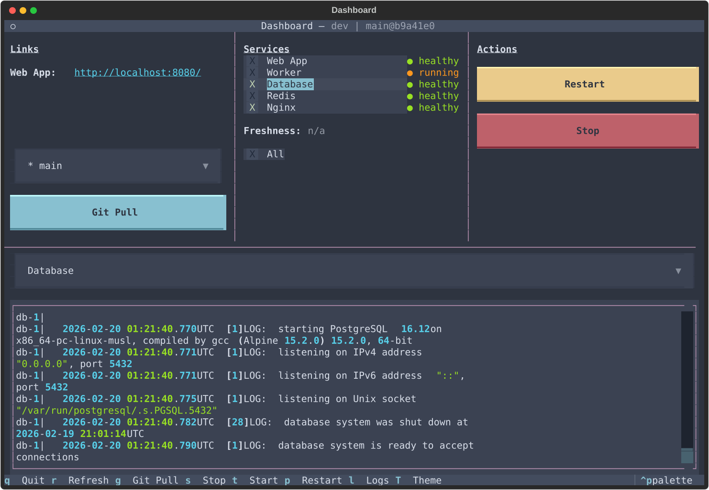
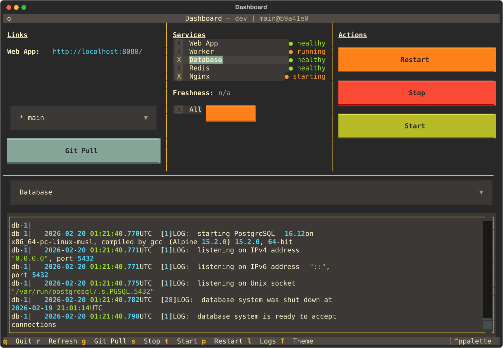
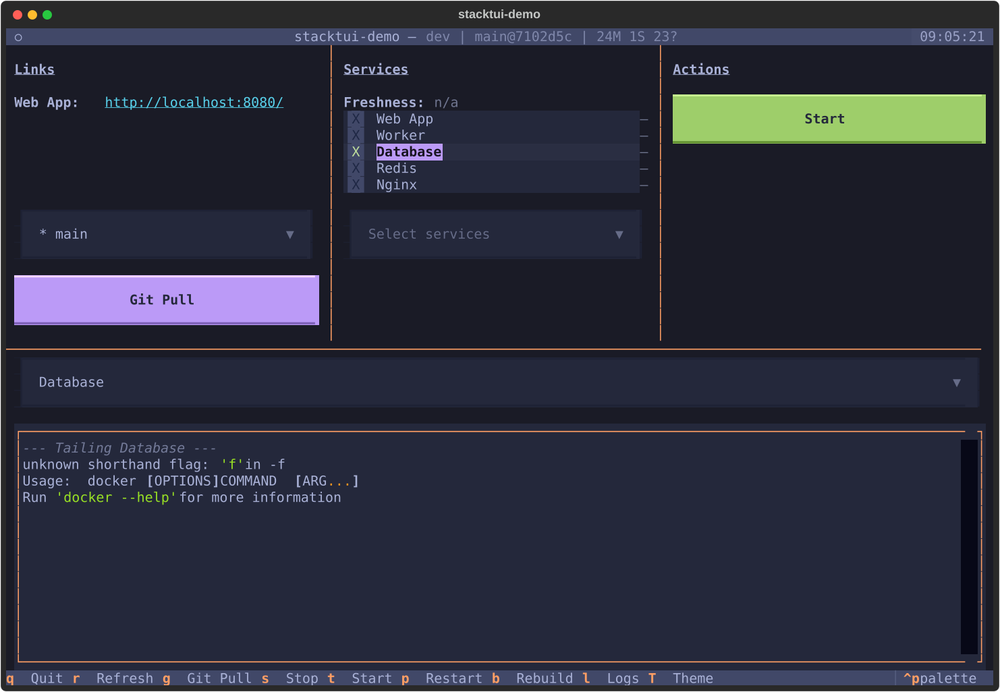

# StackTUI

A TUI dashboard for Docker Compose projects.

Monitor services, tail logs, manage deployments, and control your stack from one terminal.

## Themes

StackTUI supports 12 color themes. Press `T` to cycle through them, or use the command palette (`Ctrl+P`).

| Theme | Theme |
| --- | --- |
|  |  |
|  |  |

<details>
<summary>All available themes</summary>

catppuccin-latte, catppuccin-mocha, dracula, flexoki, gruvbox, monokai, nord, solarized-light, textual-ansi, textual-dark, textual-light, tokyo-night

</details>

## Features

- **Service monitoring** — Live health indicators (healthy/running/stopped) with colored status dots, refreshed every 10 seconds
- **Healthcheck freshness** — Shows time since last successful healthcheck for configured containers
- **Log tailing** — Stream Docker container logs or local log files in real time, switchable via dropdown
- **Service orchestration** — Stop, start, and restart selected services with smart ordering (infra first, then app services with `--build`)
- **Service selection** — Checkbox-based selection with Select All, plus quick-select buttons for changed or unhealthy services
- **Git integration** — Pull latest code, switch branches/refs, view commit history, and auto-detect affected services from diffs
- **Webhook notifications** — Banner alerts when GitHub pushes new commits to the current branch
- **Theme switching** — 12 built-in themes, cycle with `T` or pick from the command palette; set a default in config
- **Self-update** — Pulls latest code on startup; detects when the dashboard script changes and offers a reload button
- **Dev/prod modes** — Auto-detects environment via container inspection, or use `--prod`/`--dev` flags
- **Native process detection** — Monitors non-Docker processes via `pgrep` patterns (dev mode only)
- **TOML configuration** — One config file adapts the dashboard to any Docker Compose project

## Quick Start

```bash
# Clone the repo
git clone https://github.com/fuzzwah/stacktui.git
cd stacktui

# Start the demo services
docker compose -f demo/docker-compose.yml up -d

# Install dependencies and run with the demo config
uv sync
cp dashboard.demo.toml dashboard.toml
uv run python dashboard.py --dev
```

Visit <http://localhost:8080> to generate some nginx/webapp logs.

## Use With Your Project

1. Copy `dashboard.toml.example` to `dashboard.toml` in your project root
2. Configure your services, log files, and links
3. Copy `dashboard.py` into your project
4. Run it: `python dashboard.py`

See `dashboard.toml.example` for a fully annotated configuration reference.

## Keyboard Shortcuts

| Key | Action |
| --- | --- |
| `q` | Quit |
| `r` | Refresh status |
| `g` | Git pull |
| `s` | Stop selected services |
| `t` | Start selected services |
| `p` | Restart selected services |
| `l` | Focus log service selector |
| `T` | Cycle theme |

## Configuration

The dashboard reads from `dashboard.toml` (searched in CWD, then script directory). Use `--config path/to/file.toml` to specify a custom path.

Key sections:

- **`[project]`** — Project name (used for title and container name prefix)
- **`[compose]`** — Paths to dev/prod compose files
- **`[services]`** — Primary (app) and infra service lists with display labels
- **`[[path_map]]`** — Maps source file paths to services (for git-aware affected service detection)
- **`[logs]`** — Log directory and named log files
- **`[freshness]`** — Container to probe for healthcheck freshness
- **`[links]`** — URLs shown in the links panel (`{base_url}` placeholder supported)
- **`[links.dev_only]`** — Dev-only links (hidden in production mode)
- **`[urls]`** — Base URLs for dev and prod modes
- **`[prod_detection]`** — Container to check for auto-detecting production mode
- **`[theme]`** — Default theme name on startup
- **`[native_processes]`** — pgrep patterns for non-Docker service detection (dev mode only)

## Demo Environment

The `demo/` directory contains a complete example with 5 services:

| Service | Type | Description |
| --- | --- | --- |
| **webapp** | App | Flask web app with healthcheck |
| **worker** | App | Background job processor (logs to file + stdout) |
| **nginx** | Infra | Reverse proxy to webapp |
| **db** | Infra | PostgreSQL 16 |
| **redis** | Infra | Redis 7 |

Test the webhook banner: `python demo/send_webhook.py`

## Development Workflow

This project is built with [Claude Code](https://docs.anthropic.com/en/docs/claude-code) and [OpenSpec](https://github.com/openspec-dev/openspec), a spec-driven development workflow.

**How it works:**

1. **Specs describe the system** — Each major capability has a specification in `openspec/specs/` (e.g., service monitoring, log tailing, git integration). Specs define requirements, not implementation details.

2. **Changes go through artifacts** — New features follow a structured flow: proposal → design → delta specs → task list → implementation. Each artifact builds on the previous one. See `openspec/changes/archive/` for completed examples.

3. **Claude Code implements from specs** — Claude Code reads the specs and task lists, then writes the code. The specs act as a shared understanding between human and AI, keeping implementations grounded in documented requirements.

4. **Specs stay in sync** — After a change is implemented and verified, its delta specs merge into the main specs, and the change is archived. The specs always reflect the current state of the system.

The `openspec/` directory contains the full spec history. The `.claude/` directory contains the Claude Code skills that drive the workflow.

## Requirements

- Python 3.11+
- [Textual](https://github.com/Textualize/textual) >=1.0, <2.0
- Docker with Compose v2
- Git

## License

MIT
